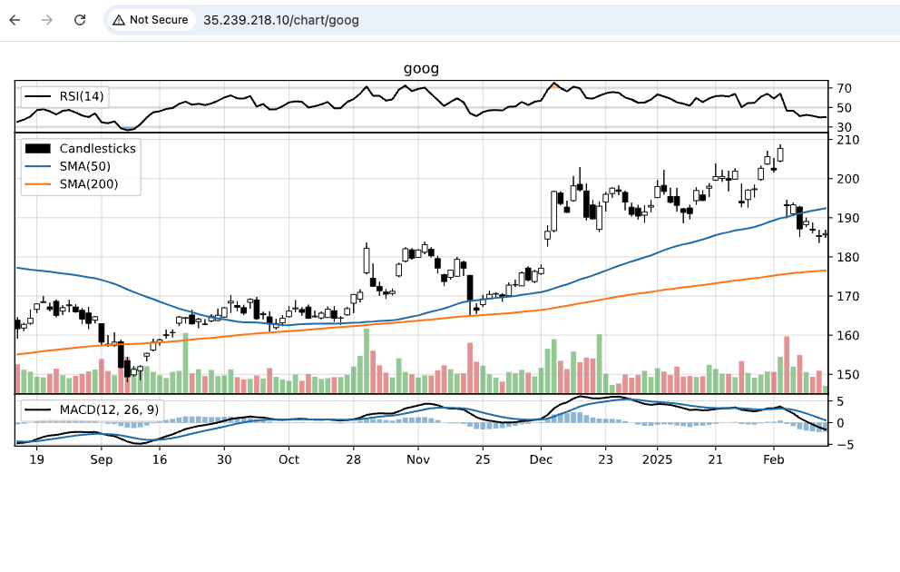

## Chart-App Overview 
This directory contains a simple python based charting application and a Dockerfile to package it into an image.  We will use this image and application to test our bash based container runtime. The application is a python based REST service that graphs the last six months of a companies stock price. It also displays a couple of moving averages and technical indicators. It returns the graph in svg format which can easily be displayed by all major web browsers.

### Endpoints
| Method | URL                          | Returns               |
---------|------------------------------|-----------------------|
| GET    | ip_addr/status               | {"status": "OK"}      | 
| GET    | ip_addr/chart/[stock-symbol] | <svg ...> ... <\/svg> |

### Screen Shot

<kbd>

</kbd>

## Build / Push Image
```
# Set an environment variable for your repo
> export my_repo=[your-repo]

# Build the chart-app image
> docker build --platform=linux/amd64 -t chart-app:1.0 .
                                                                                                                                                                                                                   
# Tag your image
> docker tag [your-image-id] ${my_repo}/chart-app:1.0

# Push the image to your repo
> docker push ${my_repo}/chart-app:1.0
```
